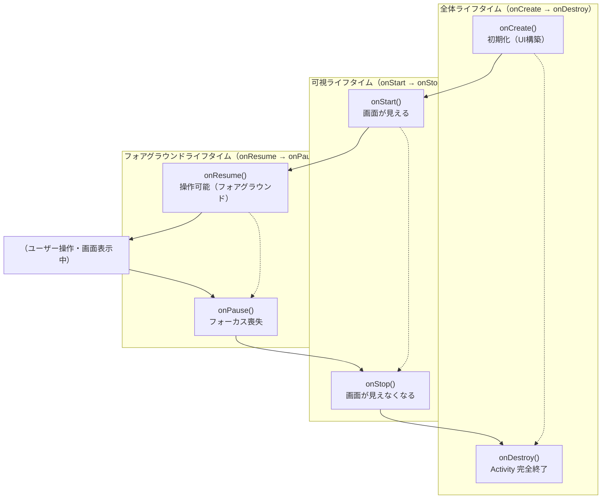
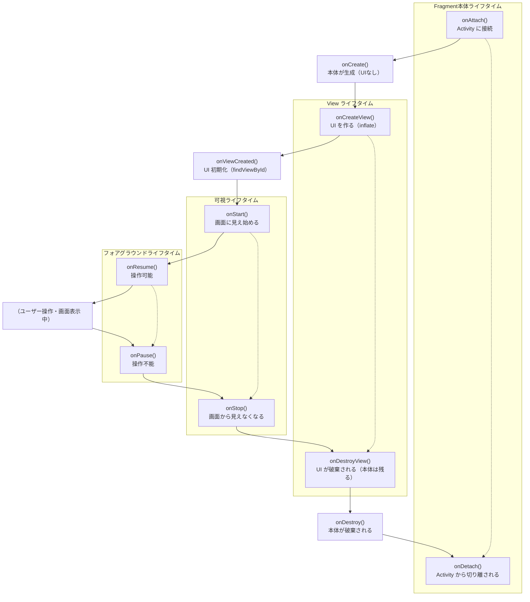
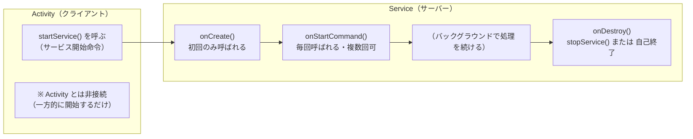
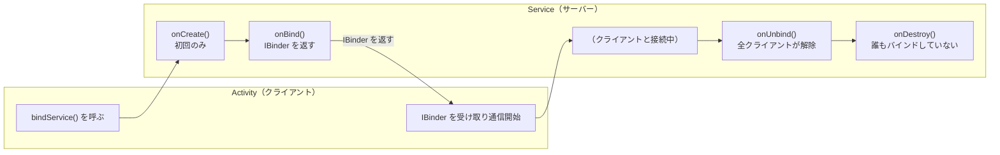

# Android Application Components

## 主なコンポーネント

- Activity
- Fragment
- Intent
- Application
- Service
- BroadcastReceive
- ContentProvider

# Activity

## Activityとは何か（概要）

### Activityの基本概念

- Androidアプリの 1画面 を表すコンポーネント
- ユーザーが直接操作する UI の中心
- OS によってライフサイクルが管理される
- Intent を使って他の Activity を起動できる
- Fragment のホストとしても機能する

## Activityの構成要素

### Activityが持つ主な機能

- `onCreate()` で UI を構築
- `onStart()` で画面が見える状態に
- `onResume()` で操作可能に
- `onPause()` で一時停止（データ保存）
- `onStop()` で画面が見えなくなる
- `onDestroy()` で破棄される

## Activityのライフサイクル（図解イメージ）

### 3つのライフタイム

- **全体ライフタイム**：onCreate → onDestroy
- **可視ライフタイム**：onStart → onStop
- **フォアグラウンドライフタイム**：onResume → onPause]



# Fragment

## Fragmentとは何か（概要）

### Fragmentの基本概念

- Activity 内で動作する **UI部品（画面の一部）**
- Activity より軽量で再利用しやすい
- スマホ・タブレットなど **画面サイズに応じた柔軟なUI構成**が可能
- Activity と同様に **独自のライフサイクル**を持つ
- AndroidX（`Fragment`）が現在の標準

## Fragmentを使う理由

### Fragmentが必要とされる場面

- 画面を複数の領域に分割したい（例：リスト＋詳細）
- タブUIやページ切り替えを実装したい
- Activity を肥大化させず、UIを分割したい
- 画面回転やマルチウィンドウに強い構造にしたい

## Fragmentの構成要素

### Fragmentが持つ主な機能

- `onCreateView()` で UI を生成
- `onViewCreated()` でイベント処理を設定
- Activity とデータをやり取り可能
- FragmentManager による追加・削除・置換が可能

## Fragmentのライフサイクル（概要）

### Activityとは異なるポイント

- **Viewの生成と破棄が独立している**
- 代表的なイベント
    - `onAttach()`: Fragment が Activity に“くっつく”タイミング
    - `onCreate()`: Fragment の“本体”が生成される（UI はまだない）
    - `onCreateView()`: FragmentのUIを作るタイミング
    - `onViewCreated()`: 作られたViewの初期化を行うタイミング
    - `onStart()`: Fragment が“画面に見え始める”
    - `onResume()`: Fragment が“操作可能になる”
    - `onPause()`: Fragment が“フォーカスを失う”（別画面へ遷移開始）
    - `onStop()`: Fragment が“画面から見えなくなる”
    - `onDestroyView()`: Fragment の“UI（View）が破棄される”
    - `onDestroy()`: Fragment の“本体が破棄される”
    - `onDetach()`: Fragment が Activity から“切り離される”

## Fragmentのライフサイクル（図解イメージ）

### View生成と破棄が明確に分かれる

- onCreateView → UIを作る
- onDestroyView → UIを破棄する
- Fragment本体は残る場合がある（Activity再生成時など）
  


## ActivityとFragmentの関係

### Activityの役割

- Fragment のホスト
- 画面全体の管理
- ナビゲーションの中心

### Fragmentの役割

- UI の一部を担当
- Activity を補完する存在

# Intent

## Intentとは何か（概要）

### Intentの基本概念

- Android の **コンポーネント間通信を行うメッセージオブジェクト**
- Activity、Service、BroadcastReceiver を起動できる
- データを添付して別コンポーネントへ渡せる
- 明示的・暗黙的の2種類がある
- Android のアプリ構造の中心的存在

## Intentの種類

### 明示的Intent（Explicit Intent）

- 起動するコンポーネントを **クラス名で指定**
- アプリ内画面遷移でよく使う

### 暗黙的Intent（Implicit Intent）

- 「何をしたいか」だけを指定
- OS が対応アプリを探して起動
- 例：共有、ブラウザ起動、地図表示、電話発信

## Intentの構成要素

### Intentが持つ主な情報

- 起動先コンポーネント（明示的の場合）
- Action（例：ACTION_VIEW, ACTION_SEND）
- Data（URI）
- Extras（追加データ）
- Flags（起動モード）

## Intentの基本コード（明示的Intent）

### 送信側(MainActivity)

```jsx
        // ボタン押下で DetailActivity を起動
        Button button = findViewById(R.id.buttonNext);
        button.setOnClickListener(v -> {
            Intent intent = new Intent(this, DetailActivity.class);
            intent.putExtra("username", "World");
            launcher.launch(intent);   // ★ 新 API の起動
        });
```

### 受信側(DetailActivity)

```jsx
        // MainActivity から受け取ったデータ
        Intent intent = getIntent();
        String username = intent.getStringExtra("username");

        TextView text = findViewById(R.id.textUser);
        text.setText("Hello " + username);
```

## Intentの基本コード

```jsx
        // ボタン押下で Google を起動
        Button button2 = findViewById(R.id.buttonGoogle);
        button2.setOnClickListener(v -> {
            Intent intent = new Intent(Intent.ACTION_VIEW);
            intent.setData(Uri.parse("https://www.google.com"));
            startActivity(intent);
        });
```

# Service

## Serviceとは何か（概要）

### Serviceの基本概念

- **バックグラウンドで動作するコンポーネント**
- UI を持たない（画面に表示されない）
- 長時間処理や継続処理に向いている
- Activity が終了しても動作を継続できる
- OS によってライフサイクルが管理される

## Serviceの種類

### 実務で使う3種類

- **通常Service**
    - バックグラウンドで処理を実行
- **Foreground Service**
    - 通知を表示しながら動作（音楽アプリなど）
- **Bound Service**
    - Activity と双方向通信（Messenger/Bind）
- ※IntentService は非推奨（WorkManager 推奨）

## Serviceのライフサイクル（概要）

### 代表的なイベント

- `onCreate()`：初期化
- `onStartCommand()`：開始処理（startService）
- `onBind()`：バインド開始（bindService）
- `onUnbind()`：バインド解除
- `onDestroy()`：終了処理

## Serviceのライフサイクル（図解イメージ）

### 通常Service/Foreground Serviceの場合（startService）

- onCreate → onStartCommand → （複数回 onStartCommand） → onDestroy

### Bound Serviceの場合（bindService）

- onCreate → onBind → onUnbind → onDestroy



[サービスの概要  |  Background work  |  Android Developers](https://developer.android.com/develop/background-work/services?hl=ja&_gl=1*18gaqkj*_up*MQ..*_ga*Mzk0NDc0NTI0LjE3NzYwMDQyOTQ.*_ga_6HH9YJMN9M*czE3NzYwMDQyOTQkbzEkZzAkdDE3NzYwMDQyOTQkajYwJGwwJGgxOTA4ODg3OTQy)

### startServiceとbindServiceの違い

| 種類 | 目的 | ライフサイクル | 終了タイミング |
| --- | --- | --- | --- |
| startService | バックグラウンド処理を継続 | onCreate → onStartCommand(複数回) → onDestroy | stopService() または自己終了 |
| bindService | Activity などと通信 | onCreate → onBind → onUnbind → onDestroy | 全クライアントが unbind |

# BroadCastReceiver

## BroadcastReceiverとは何か（概要）

### BroadcastReceiverの基本概念

- Android の **システムイベントやアプリ間イベントを受信するコンポーネント**
- UI を持たない（画面に表示されない）
- OS や他アプリから送られる **Broadcast（通知）** を受け取って処理する
- 軽量で、短時間の処理に向いている
- Manifest 登録 or 動的登録（registerReceiver）が可能

## BroadcastReceiverを使う理由

### BroadcastReceiverが必要とされる場面

- 充電開始/終了、ネットワーク変化など **システムイベントの検知**
- アプリ内でのイベント通知
- アラーム（AlarmManager）からの通知受信
- バックグラウンドでの軽量処理
- 他アプリからの Intent を受信したい場合

## BroadcastReceiverの種類

### 実務で使う2種類

- **静的レシーバー（Manifest登録）**
    - アプリが起動していなくても受信可能
    - Android 8.0 以降は制限あり（多くは不可）
- **動的レシーバー（registerReceiver）**
- Activity/Service のライフサイクルに紐づく
- 柔軟で実務ではこちらが主流

## BroadcastReceiverの基本コード構造（Java）

### 動的登録（registerReceiver）の例

```jsx
public class MainActivity extends AppCompatActivity {

    private BroadcastReceiver receiver = new BroadcastReceiver() {
        @Override
        public void onReceive(Context context, Intent intent) {
            String action = intent.getAction();
            if (Intent.ACTION_BATTERY_CHANGED.equals(action)) {
                // バッテリー状態を受信
            }
        }
    };

    @Override
    protected void onStart() {
        super.onStart();
        IntentFilter filter = new IntentFilter(Intent.ACTION_BATTERY_CHANGED);
        registerReceiver(receiver, filter);
    }

    @Override
    protected void onStop() {
        super.onStop();
        unregisterReceiver(receiver);
    }
}
```

## 静的登録（Manifest）の例

### AndroidManifest

```jsx
<receiver android:name=".MyReceiver">
    <intent-filter>
        <action android:name="android.intent.action.BOOT_COMPLETED" />
    </intent-filter>
</receiver>
```

### java

```jsx
public class MyReceiver extends BroadcastReceiver {
    @Override
    public void onReceive(Context context, Intent intent) {
        if (Intent.ACTION_BOOT_COMPLETED.equals(intent.getAction())) {
            // 端末起動完了を受信
        }
    }
}
```

## BroadcastReceiverを使うメリット（実務視点）

## 軽量で効率的

- システムイベントを簡単に受け取れる
- Activity が動いていなくても受信可能（条件付き）
- アプリ間通信が可能
- AlarmManager と組み合わせて定期処理が可能

# Application

## Applicationとは何か（概要）

### Applicationの基本概念

- Android アプリ全体を表す **最上位コンポーネント**
- アプリ起動時に **最初に生成され、最後に破棄される**
- 全 Activity / Service / Receiver から共有される
- グローバルな初期化処理を行う場所
- 1アプリにつき1つだけ存在する

## Applicationを使う理由

### Applicationが必要とされる場面

- アプリ全体で共有するデータの管理
- DI（依存性注入）やライブラリの初期化
- シングルトンの管理
- ログ設定、クラッシュレポート設定
- アプリ起動時の共通処理

## Applicationのライフサイクル（概要）

### 代表的なイベント

- `onCreate()`：アプリ起動時に1回だけ呼ばれる
- `onTerminate()`：エミュレータのみ（実機ではほぼ呼ばれない）

### 特徴

- Activity や Service よりも **長いライフサイクル**
- アプリが完全に終了するまで保持される