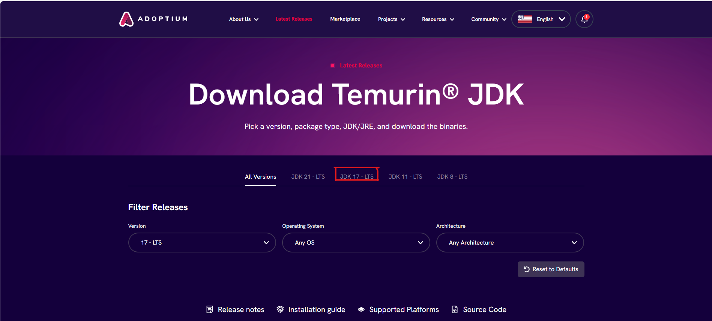
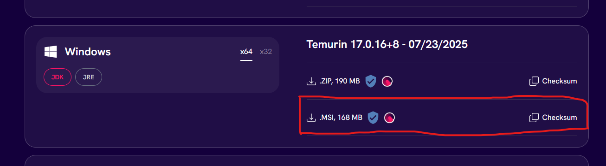
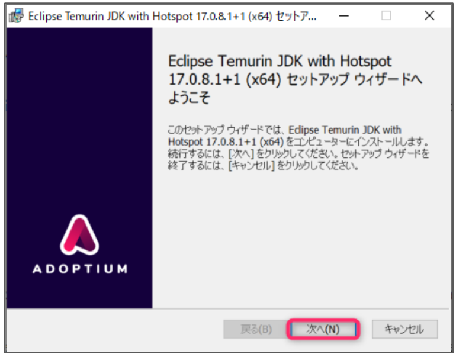
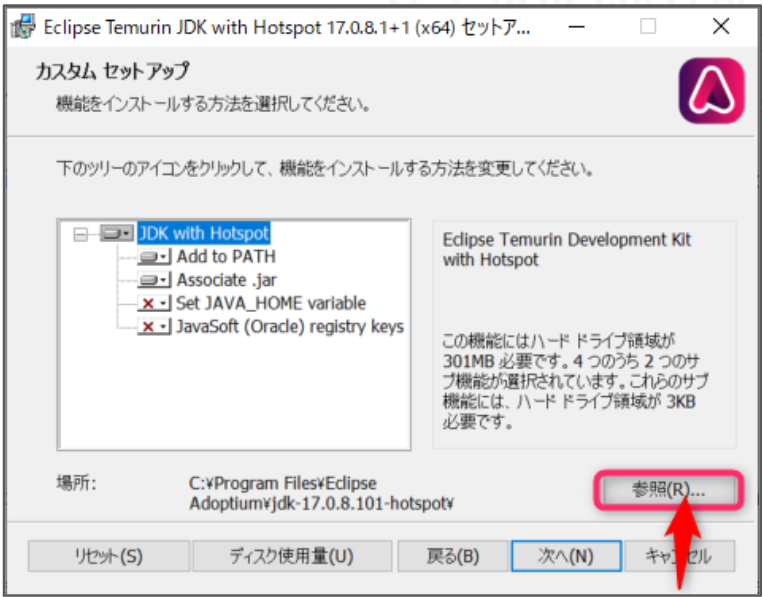
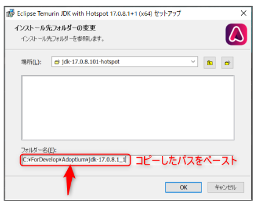
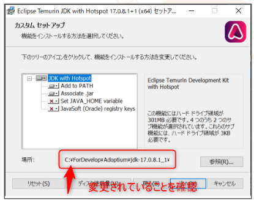
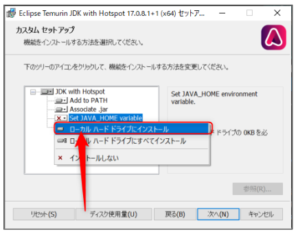
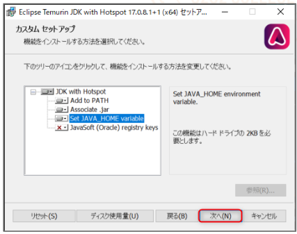

# Java(Adoptium)環境構築手順書

## はじめに
本書では、Javaプログラムの実行に必要なOpenJDK(Open Java Development Kit)の一種「Adoptium (旧 Adopt OpenJDK)」のインストール方法と、Javaのプログラム実行方法について解説する。

## インストール
### １．インストーラーのダウンロード
- 以下のURLにアクセスし、対象のバージョンのインストーラーをダウンロードする。
https://www.google.com/url?q=https://adoptium.net/temurin/releases/&sa=D&source=editors&ust=1756522794139285&usg=AOvVaw22BsmUfV-sBDjy5AnMqZxs  

- 今回はバージョン17.0.16を使用する。（受講したUdemy講座でバージョン17が使用されていたため）  

### ２．インストール先フォルダの作成
- Cドライブ直下に「ForDevelop」というフォルダを作成する
- 「ForDevelop」内に「Adoptium」というフォルダを作成する
- 「Adoptium」フォルダ内に１でダウンロードしたインストーラー名のフォルダを作成する  
~~~
C:\ForDevelop\Adoptium\OpenJDK17U-jdk_x64_windows_hotspot_17.0.16_8.msi
~~~

### ３．インストール
- ダウンロードしたインストーラーを実行すると以下の画面が表示されるので「次へ」をクリックする。

- 使用許諾契約の画面で同意欄にチェックを入れ「次へ」を押す
- インストールする範囲を選択して「次へ」を押すと、以下の画面になる
- 「参照」を押す

- インストール先フォルダに２で作成したフォルダ名を指定する。(画像は例。実際に作成したフォルダ名をコピー＆ペーストすること)  

- インストール先が変更されていることを確認する。(**!まだ次へは押さない!**)

- Set Java_HOME variableの「×」ボタンを押す
- 「ローカルハードディスクドライブにインストール」を選択
- 「次へ」→「インストール」→「完了」  

### ４．環境変数の確認
- コマンドプロンプトを開く
- 「java -version」と入力しEnterキーを押下する
- 「set JAVA_HOME」と入力し、Enterキーを押下する
~~~
$ java -version
openjdk version "17.0.16" 2025-07-15
OpenJDK Runtime Environment Temurin-17.0.16+8 (build 17.0.16+8)
OpenJDK 64-Bit Server VM Temurin-17.0.16+8 (build 17.0.16+8, mixed mode, sharing)
~~~

~~~
$ set JAVA_HOME
JAVA_HOME=C:\ForDevelop\Adoptium\OpenJDK17U-jdk_x64_windows_hotspot_17.0.16_8.msi\
~~~

## JAVAプログラム実行方法
- 今回はCドライブ直下の「WorkSpace」というフォルダにプログラムを保存し実行する方法を示す。

#### Sample.java
~~~java
public class Sample {
    public static void main(String[] args) {
        System.out.println("This is a sample Java file.");
    }
}
~~~
~~~bash
$ cd C:\WorkSpace
$ javac -encoding UTF-8 Sample.java # Windowsの場合デフォルトのエンコードがShift-JISなので、作成したプログラムがutf8形式の場合は「-encoding UTF-8」オプションで指定する必要がある
$ java Sample
This is a sample Java file.
~~~
