# MySQL基本構文実践書

<!-- omit in toc -->
## はじめに
本書は、RDBMSのオープンソースソフトウェアである「MySQL」の基本構文を実践した際のメモ書きを残し、いつでも見返せる状態にすることを目的とする。
後に記す実行環境の作成には「[MySQL環境構築手順書](../mysql環境構築手順書/mysql環境構築手順書.md)」を参照するとよい。

<!-- omit in toc -->
## 目次
- [実行環境](#実行環境)
- [基本構文の説明および実践](#基本構文の説明および実践)
  - [CREATE TABLE (テーブルの作成)](#create-table-テーブルの作成)
    - [説明](#説明)
    - [実践](#実践)
  - [INSERT（レコードの挿入）](#insertレコードの挿入)
    - [説明](#説明-1)
    - [実践](#実践-1)
  - [SELECT（データの検索）](#selectデータの検索)
    - [説明](#説明-2)
    - [実践](#実践-2)
  - [UPDATE（データの更新）](#updateデータの更新)
    - [説明](#説明-3)
    - [実践](#実践-3)
  - [DELETE（レコードの削除）](#deleteレコードの削除)
    - [説明](#説明-4)
    - [実践](#実践-4)
  - [ALTER TABLE （テーブルの仕様変更）](#alter-table-テーブルの仕様変更)
    - [説明](#説明-5)
      - [カラムの追加](#カラムの追加)
        - [最後尾に追加する場合（ADD）](#最後尾に追加する場合add)
        - [先頭に追加する場合（ADD - FIRST）](#先頭に追加する場合add---first)
        - [既存カラムの後に追加する場合（ADD - AFTER）](#既存カラムの後に追加する場合add---after)
      - [カラム情報の変更](#カラム情報の変更)
        - [カラム名の変更（RENAME COLUMN）](#カラム名の変更rename-column)
        - [カラム定義（型,オプション）の変更（MODIFY）](#カラム定義型オプションの変更modify)
        - [全カラム情報の変更（CHANGE）](#全カラム情報の変更change)
      - [カラムの削除](#カラムの削除)
    - [実践](#実践-5)
  - [TRUNCATE（テーブルの全レコード削除）](#truncateテーブルの全レコード削除)
    - [説明](#説明-6)
    - [実践](#実践-6)
  - [DROP（テーブルの削除）](#dropテーブルの削除)
    - [説明](#説明-7)
    - [実践](#実践-7)

## 実行環境
- Windows11（64ビット）  
- mysql v8.0.21  
- A5M2(A5:SQL Mk-2) v2.20.4  

## 基本構文の説明および実践
以下で記したA5M2の設定（MySQLでのテスト用データベースの作成、およびA5M2への接続）ができていることを前提条件とする。  
[MySQL環境構築手順書>SQLクライアントツール（A5M2）の設定](../mysql環境構築手順書/mysql環境構築手順書.md#sqlクライアントツールa5m2の設定)  

### CREATE TABLE (テーブルの作成)
#### 説明
テーブルを作成するには**DDL**（データ定義言語）の「CREATE TABLE」構文を用いる。  
CREATE TABLE構文は以下の形式で記述する。  
~~~
CREATE TABLE 【作成するテーブル名】 (  
　【カラム名1(必須)】  　【データ型(必須)】  　【オプション(任意)】  
　【カラム名2(必須)】  　【データ型(必須)】  　【オプション(任意)】  
　【カラム名2(必須)】  　【データ型(必須)】  　【オプション(任意)】  
　　　　　　・ 　　　　　　　　　・　　　　　　　　　　　・   
　　　　　　・ 　　　　　　　　　・　　　　　　　　　　　・   
　　　　　　・ 　　　　　　　　　・　　　　　　　　　　　・   
);    
~~~

以下に「SAMPLE_3_1_1」テーブル（ペットの情報）を作成する例を記す。  

**CREATE TABLE構文サンプル**
~~~
CREATE TABLE SAMPLE_3_1_1 (
  ID                INT          NOT NULL PRIMARY KEY                 COMMENT 'ペットID'             ,
  NAME              VARCHAR(30)  NOT NULL                             COMMENT '名前'                 ,
  GENDER            CHAR(1)      NOT NULL                             COMMENT '性別（男：M／女：F）' ,
  BIRTHDAY          DATE         NOT NULL                             COMMENT '生年月日'             ,
  WEIGHT            DECIMAL(4,1)                                      COMMENT '体重'                 ,
  REGIST_TIMESTAMP  DATETIME     NOT NULL DEFAULT CURRENT_TIMESTAMP   COMMENT '登録日時' 
);
~~~

例コード中のオプション情報について、以下に補足する。
- NOT NULL : その列はNULL（空白）を許さないことを示す。。  
- PRIMARY KEY : その列はプライマリーキーであることを示す。  
- DEFAULT ～～ : その列を空白にした場合、デフォルト値として～～を採用することを示す。  
- COMMENT : カラムの論理名を示す。（物理名は一番最初の要素で指定した'カラム名'）　

#### 実践
1. A5M2でテスト用データベース（sample_test_db）を開く。  
2. Query-1に**CREATE TABLE構文サンプル**を貼り付ける。  
3. 対象の行全て（今回の場合は1~8行目）を選択した状態で画面左上の実行ボタン（SQL
を実行・キャレット位置）を押す。
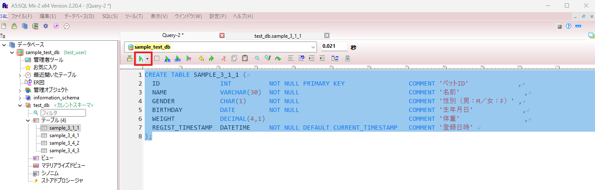
4. 画面左側のウィンドウの対象スキーマにテーブル「sample_3_1_1」が追加されるのでダブルクリックし、開く。  
5. 更新ボタンを押し、テーブルを更新する。 
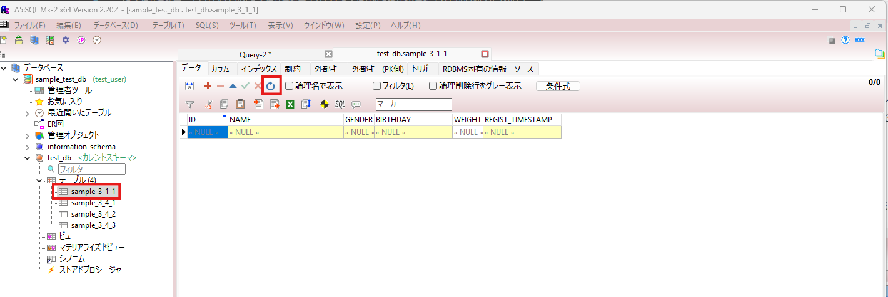

### INSERT（レコードの挿入）
#### 説明
レコードを挿入するには**DML**（データ操作言語）のINSERT構文を用いる。  
INSERT構文は以下の形式で記述する。  
~~~
INSERT INTO 【挿入先テーブル名】 (【挿入するテーブルのカラム情報】)  
             　　　　　　VALUES (【挿入するデータ】);  
~~~
※一つのテーブルに複数のレコードを挿入したい場合でも、レコードの分だけINSERT構文を記述する必要がある。  
以下に「SAMPLE_3_1_1」テーブルに複数レコードのデータを挿入するサンプル文を記述する。 

**INSERT構文サンプル**
~~~
INSERT INTO SAMPLE_3_1_1 (ID , NAME     , GENDER , BIRTHDAY     , WEIGHT , REGIST_TIMESTAMP      )
                  VALUES (1  , 'MOCO'   , 'F'    , '2014-05-04' , 3.5    , '2020-08-01 00:00:00' ) ;
INSERT INTO SAMPLE_3_1_1 (ID , NAME     , GENDER , BIRTHDAY     , WEIGHT , REGIST_TIMESTAMP      )
                  VALUES (2  , 'CHOCO'  , 'M'    , '2011-08-25' , 5.2    , '20200801000000'      ) ;
INSERT INTO SAMPLE_3_1_1 (ID , NAME     , GENDER , BIRTHDAY     , WEIGHT , REGIST_TIMESTAMP      )
                  VALUES (3  , 'TARO'   , 'M'    , '2013-01-02' , 6.2    , CURRENT_TIMESTAMP     ) ;
INSERT INTO SAMPLE_3_1_1 (ID , NAME     , GENDER , BIRTHDAY              , REGIST_TIMESTAMP      )
                  VALUES (4  , 'RINRIN' , 'F'    , '2015-12-12'          , NOW()                 ) ;
INSERT INTO SAMPLE_3_1_1 (ID , NAME     , GENDER , BIRTHDAY     , WEIGHT                         )
                  VALUES (5  , 'CHAMP'  , 'M'    , '2013-01-02' , 10.9                           ) ;
~~~

#### 実践
1. CREATE_TABLEの際と同様に、A5M2のQuery-1に**INSERT構文サンプル**を貼り付ける。
2. 対象の行全てを選択した状態で画面左上の実行ボタン（SQLを実行・キャレット位置）を押す。
3. テーブル「sample_3_1_1」を開き、更新すると、挿入したデータが反映される。  
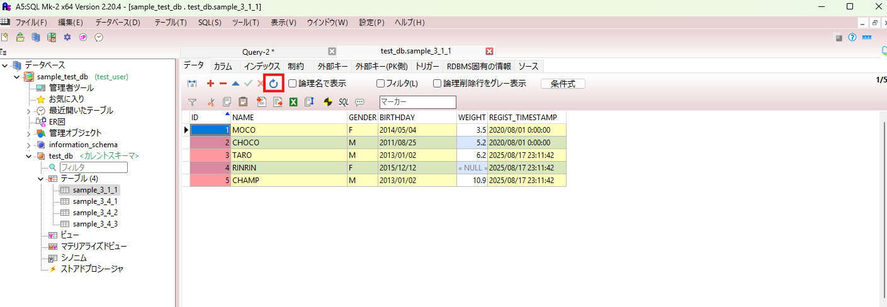

### SELECT（データの検索）
#### 説明
テーブルから特定のデータを検索するには**DML**（データ操作言語）のSELECT構文を用いる。  
SELECT構文は以下の形式で記述する。  
~~~
SELECT 【取得したいカラム名】  
  FROM 【検索先テーブル名】  
 WHWRE 【検索条件】
~~~

以下に「SAMPLE_3_1_1」テーブルから性別が雌（F）のペットのID、名前、性別を取得するサンプル文を記述する。  

**SELECT構文サンプル**
~~~
SELECT ID , NAME , GENDER
  FROM SAMPLE_3_1_1
 WHERE GENDER = 'F' ;
~~~

#### 実践
1. CREATE_TABLEの際と同様に、A5M2のQuery-1に**SELECT構文サンプル**を貼り付ける。
2. 対象の行全てを選択した状態で画面左上の実行ボタン（SQLを実行・キャレット位置）を押す。
3. 画面下側に取得したデータが表示される。 
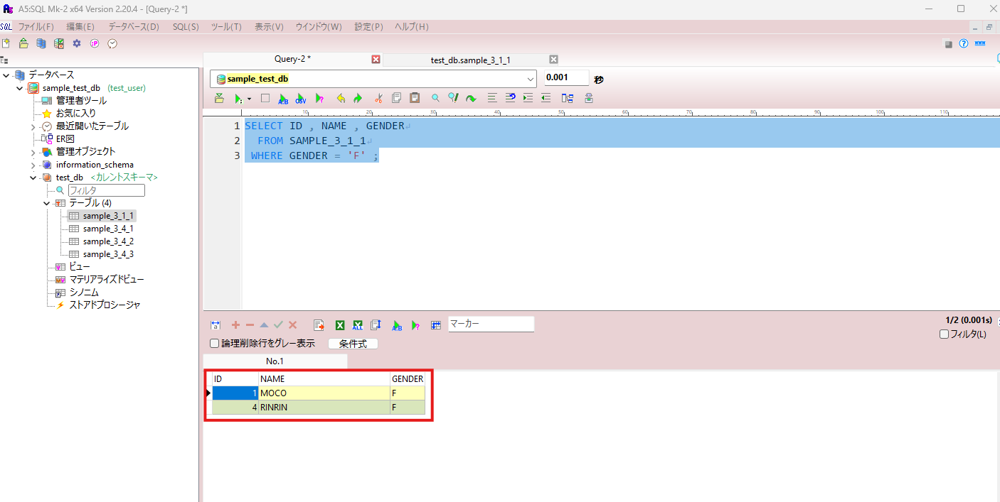

### UPDATE（データの更新）
#### 説明
テーブル上のデータを更新（上書き）する際は**DML**（データ操作言語）のUPDATE構文を用いる。  
UPDATE構文は以下の形式で記述する。  
~~~
UPDATE 【更新するテーブル名】  
   SET 【上書きしたいカラム名1】 =【カラム1の新しいデータ】,  
       【上書きしたいカラム名2】 =【カラム2の新しいデータ】,
                ・                         ・          ,
                ・                         ・          ,
                ・                         ・          

 WHWRE 【上書きしたいレコードのプライマリーキー】 = 【プライマリーキーの値】
~~~

以下にプライマリーキー（ペットID）1　の名前を'MOCOMOCO'に、体重を4.5に上書きする例のサンプル文を記述する。

**UPDATE構文サンプル**
~~~
UPDATE SAMPLE_3_1_1
   SET NAME   = 'MOCOMOCO' ,
       WEIGHT = 4.5
 WHERE ID     = 1 ;
~~~

#### 実践
1. CREATE_TABLEの際と同様に、A5M2のQuery-1に**UPDATE構文サンプル**を貼り付ける。
2. 対象の行全てを選択した状態で画面左上の実行ボタン（SQLを実行・キャレット位置）を押す。
3. テーブル「sample_3_1_1」を開き、更新すると、データが更新される。  
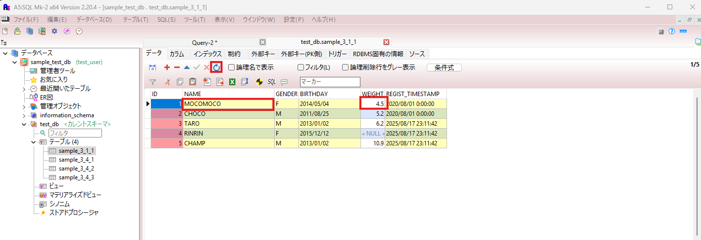

### DELETE（レコードの削除）
#### 説明
レコード（行）単位でデータを削除する際は**DML**（データ操作言語）のDELETE構文を用いる。  
DELETE構文は以下の形式で記述する。  
~~~
DELETE FROM 【削除対象のテーブル名】
 WHERE 【プライマリーキーのカラム名】 = 【削除するレコードのプライマリーキーの値】
~~~

以下に「SAMPLE_3_1_1」テーブルからプライマリーキー（ペットID）2 レコードを削除するサンプル文を記述する。  

**DELETE構文サンプル**
~~~
DELETE FROM SAMPLE_3_1_1
 WHERE ID = 2 ;
~~~

#### 実践
1. CREATE_TABLEの際と同様に、A5M2のQuery-1に**DELETE構文サンプル**を貼り付ける。
2. 対象の行全てを選択した状態で画面左上の実行ボタン（SQLを実行・キャレット位置）を押す。
3. テーブル「sample_3_1_1」を開き、更新すると、対象のレコードが削除される。  
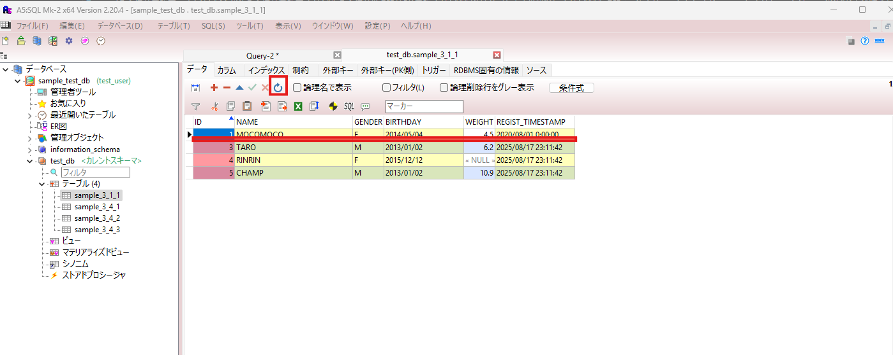

### ALTER TABLE （テーブルの仕様変更）
#### 説明
既存のテーブルにカラムを追加したり型,オプションを変更する際は**DDL**（データ定義言語）のALTER TABLE構文を用いる。  
##### カラムの追加
###### 最後尾に追加する場合（ADD）
~~~
ALTER TABLE 【テーブル名】
  ADD 【追加するカラム名】 【追加カラムの型】 【追加カラムのオプション情報】;
~~~

###### 先頭に追加する場合（ADD - FIRST）
~~~
ALTER TABLE 【テーブル名】
  ADD 【追加するカラム名】 【追加カラムの型】 【追加カラムのオプション情報】 FIRST;
~~~  

###### 既存カラムの後に追加する場合（ADD - AFTER）
~~~
ALTER TABLE 【テーブル名】
  ADD 【追加するカラム名】 【追加カラムの型】 【追加カラムのオプション情報】 AFTER 【既存カラム名】;
~~~

##### カラム情報の変更
###### カラム名の変更（RENAME COLUMN）
~~~
ALTER TABLE 【テーブル名】
 RENAME COLUMN 【対象カラム名】 TO 【変更後のカラム名】;
~~~

###### カラム定義（型,オプション）の変更（MODIFY）
~~~
ALTER TABLE 【テーブル名】
 MODIFY 【対象カラム名】 【変更後のカラム定義】;
~~~

###### 全カラム情報の変更（CHANGE）
~~~
ALTER TABLE 【テーブル名】
 CHANGE 【対象カラム名】 【変更後のカラム名】 【変更後のカラム定義】
~~~

##### カラムの削除
~~~
ALTER TABLE 【テーブル名】
  DROP 【削除するカラム名】;
~~~

以下に「SAMPLE_3_1_1」テーブルの末尾にCOLORカラムを追加し、追加したカラムの情報を変更し、最後にそのカラムを削除するサンプル文を記述する。
**ALTER TABLE構文サンプル**
~~~
#カラムの追加
ALTER TABLE SAMPLE_3_1_1
  ADD COLOR VARCHAR(15) NOT NULL DEFAULT 'WHITE' COMMENT '毛色' AFTER WEIGHT ;

#カラム名の変更
ALTER TABLE SAMPLE_3_1_1
  RENAME COLUMN COLOR TO FUR_COLOR ;

#カラム定義（型＋オプション）の変更
ALTER TABLE SAMPLE_3_1_1
  MODIFY FUR_COLOR VARCHAR(30) DEFAULT 'BROWN' ;

#カラム名＋カラム定義（型＋オプション）の変更
ALTER TABLE SAMPLE_3_1_1
  CHANGE FUR_COLOR DOGS_FUR_COLOR VARCHAR(30) NOT NULL DEFAULT 'BROWN' COMMENT '犬の毛色' ;

#カラムの削除
ALTER TABLE SAMPLE_3_1_1
  DROP DOGS_FUR_COLOR ;
~~~

#### 実践
1. CREATE_TABLEの際と同様に、A5M2のQuery-1に**ALTER TABLE構文サンプル**を貼り付ける。
2. 「カラムの追加」部分を選択した状態で画面左上の実行ボタン（SQLを実行・キャレット位置）を押す。
3. テーブル「sample_3_1_1」を開き、更新すると、対象のカラムが追加される。 
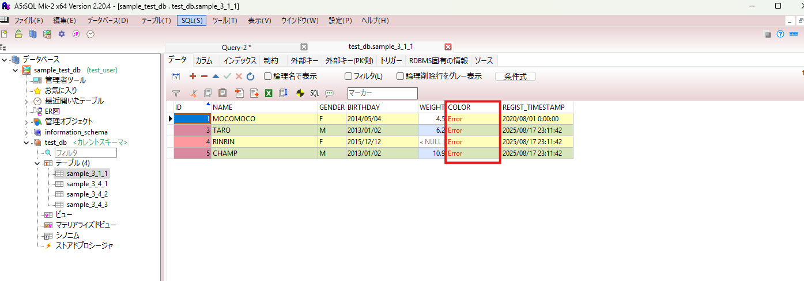
4. 「カラム名の変更」部分を選択した状態で画面左上の実行ボタン（SQLを実行・キャレット位置）を押す。
5. テーブル「sample_3_1_1」を開き、更新すると、対象のカラム名が変更される。 
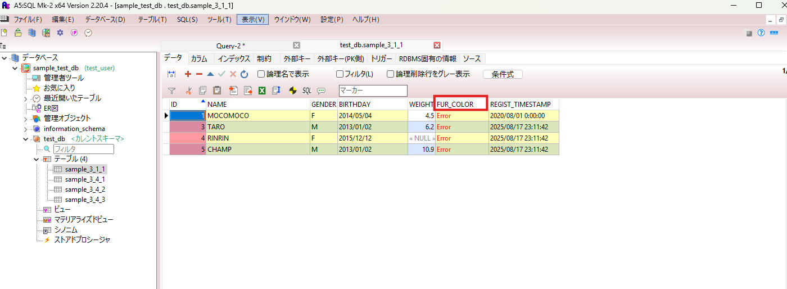
6. 「カラム定義（型＋オプション）の変更」部分を選択した状態で画面左上の実行ボタン（SQLを実行・キャレット位置）を押す。
7. テーブル「sample_3_1_1」のカラムタブを右クリックし「カラムの再読み込み」を押すと、対象のカラムの情報が変更される。 
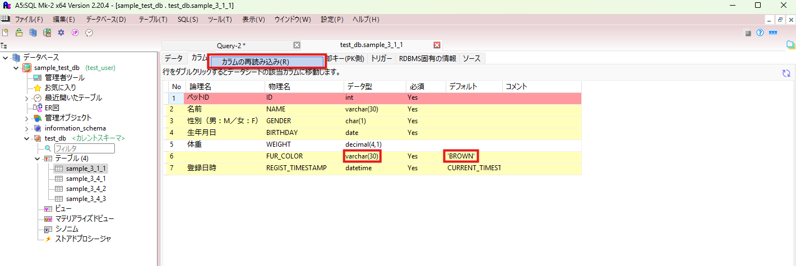
8. 「カラム名＋カラム定義（型＋オプション）の変更」部分を選択した状態で画面左上の実行ボタン（SQLを実行・キャレット位置）を押す。
9. テーブル「sample_3_1_1」のカラムタブを右クリックし「カラムの再読み込み」を押すと、対象のカラムの情報が変更される。 
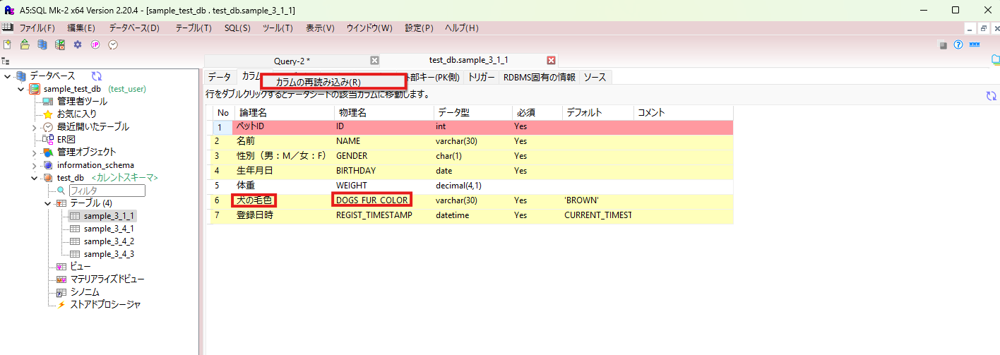
10. 「カラムの削除」部分を選択した状態で画面左上の実行ボタン（SQLを実行・キャレット位置）を押す。
11. テーブル「sample_3_1_1」を開き、更新すると、対象のカラムが削除される。
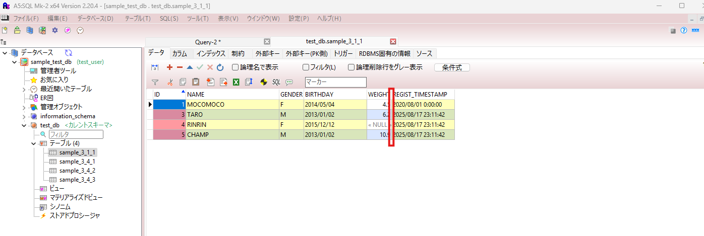

### TRUNCATE（テーブルの全レコード削除）
#### 説明
テーブル内の全レコードを削除する際は**DDL**（データ定義言語）のTRUNCATE構文を用いる。  
TRUNCATE構文は以下の形式で記述する。  
~~~
TRUNCATE 【テーブル名】;
~~~

**TRUNCATE構文サンプル**
~~~
TRUNCATE SAMPLE_3_1_1 ;
~~~

#### 実践
1. CREATE_TABLEの際と同様に、A5M2のQuery-1に**TRUNCATE構文サンプル**を貼り付ける。
2. 対象行を選択した状態で画面左上の実行ボタン（SQLを実行・キャレット位置）を押す。
3. テーブル「sample_3_1_1」を開き、更新すると、全レコードが削除される。
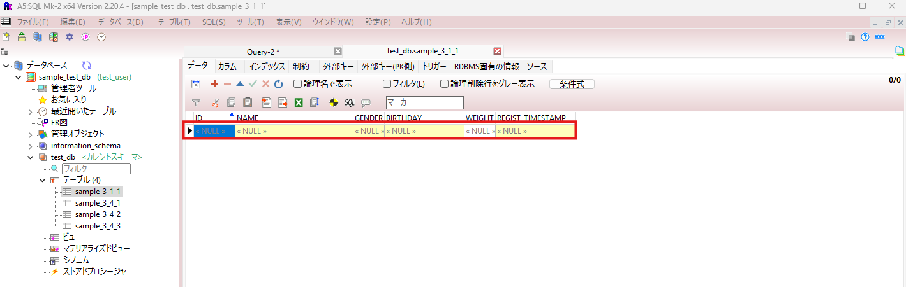

### DROP（テーブルの削除）
#### 説明
テーブルの定義そのものを削除する際は**DDL**（データ定義言語）のDROP構文を用いる。  
DROP構文は以下の形式で記述する。  
~~~
DROP TABLE 【テーブル名】;
~~~

**TRUNCATE構文サンプル**
~~~
DROP TABLE SAMPLE_3_1_1 ;
~~~

#### 実践
1. CREATE_TABLEの際と同様に、A5M2のQuery-1に**DROP構文サンプル**を貼り付ける。
2. 対象行を選択した状態で画面左上の実行ボタン（SQLを実行・キャレット位置）を押す。
3. テーブル「sample_3_1_1」を開き、更新すると、エラーメッセージが表示される。（テーブルそのものが削除されたため）
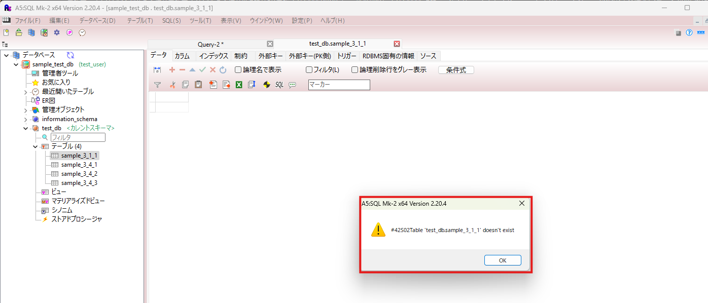
