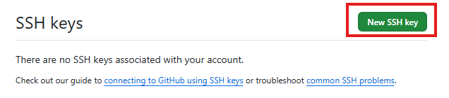
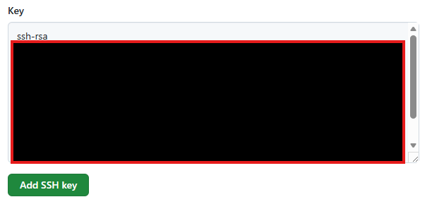

## はじめに
本書ではGitのSSH設定手順を示す。

## 前提条件
GitHubアカウントをもっていること  

## SSH設定手順
1. ユーザーのホームディレクトリへ移動する
    ```bash
    $ cd ~
    ```

2. GitHubへアクセスできないことの確認
    ```bash
    $ ssh -T git@github.com
    ```
       すると、以下のようなメッセージが出てくるので"yes"を入力する。  
    ```
    The authenticity of host 'github.com (20.27.177.113)' can't be established.
    ED25519 key fingerprint is SHA256:+
    This key is not known by any other names
    Are you sure you want to continue connection (yes/no/[fingerprint])? 
    $ yes
    Warning: Permanently added 'github.com' (ED25519) to the list of known hosts.
    git@github.com: Permission denied (publickey).
    ```
    
3. パブリックキー/プライベートキーの作成
   ```bash
   $ cd .ssh
   $ ssh-keygen -t rsa
   ```
   すると、以下のように保存場所、パスフレーズの設定が求められるが、今回は指定せずそのままEnterを押す。  
   ```
   Generating public/private rsa key pair.
   Enter file in which to save the key (/c/Users/itohi/.ssh/id_rsa): 
   Enter passphrase for "/c/Users/itohi/.ssh/id_rsa" (empty for no passphrase): 
   Enter same passphrase again: 
   ```

   以下のように表示されれば、キーの作成完了  
   ```bash
   $ ssh-keygen -t rsa
   Generating public/private rsa key pair.
   Enter file in which to save the key (/c/Users/itohi/.ssh/id_rsa): 
   Enter passphrase for "/c/Users/itohi/.ssh/id_rsa" (empty for no passphrase): 
   Enter same passphrase again: 
   Your identification has been saved in /c/Users/itohi/.ssh/id_rsa
   Your public key has been saved in /c/Users/itohi/.ssh/id_rsa.pub
   The key fingerprint is:
   SHA256:UKvq9WNarw/BB3l2imJQVE4tU8jofp3R2Hg4Iqy/QFU itohi@DellSlimECS1250
   The key's randomart image is:
   +---[RSA 3072]----+
   |     .o+E+.      |
   |     ..==o.      |
   |    .oo =oo*.    |
   |     o++.=*o+    |
   |    .o+.Soo=     |
   |   ..o...oo      |
   |    o...o        |
   |   . o.ooo       |
   |    . o+o+o      |
   +----[SHA256]-----+
   ```

4. 作られたキーの確認
   lsコマンドを実行する  
   ```bash
   $ ls -l
   total 6
   -rw-r--r-- 1 itohi 197609 2610 12月 21 11:42 id_rsa
   -rw-r--r-- 1 itohi 197609  575 12月 21 11:42 id_rsa.pub
   -rw-r--r-- 1 itohi 197609   92 12月 21 11:39 known_hosts
   ```

   `id-rsa`が秘密鍵、`id-rsa.pub`は公開鍵である。  
   秘密鍵は絶対に外部に公開しないこと。  

5. 公開鍵のGithubへの設定
   以下のサイトにアクセスする  
   https://github.com/settings/keys

   `New SSH key`をクリックする  
     

   `Title`に適当な名前を入れる  
     

   公開鍵をコピーし、`Key`に貼り付ける  
   ```bash
   $ clip < ~/.ssh/id_rsa.pub
   ```
   

   `Add SSH Key`をクリックする  

6. 公開鍵が登録され、GitHubにアクセスできるようになったことを確認する
   以下のようにHi `yousername` You've successfully authenticated, but GitHub dose not provide shell access.と表示されればOK。  
   ```bash
   $ ssh -T git@github.com
   Hi Bombsmash! You've successfully authenticated, but GitHub does not provide shell access.
   ```
   1. ターミナルとGithubアカウントの紐づけ(やってなければ)
   ```bash
   $ git config --global user.name "ACCOUNT"
   $ git config --global user.email "xxx@gmail.com"
   $ cat ~/.gitconfig
   [user]
           name = ACCOUNT
           email = XXX@example.com
   ```
