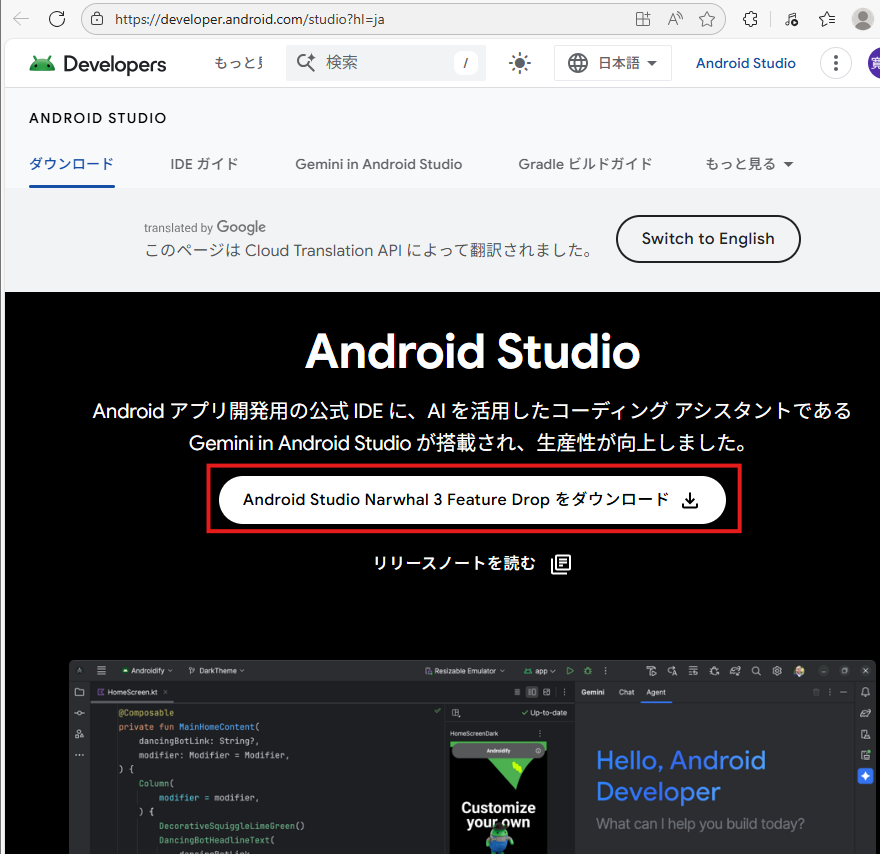
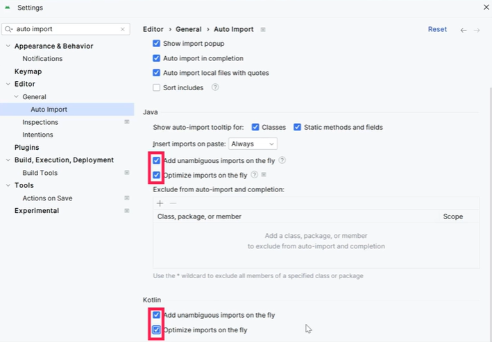
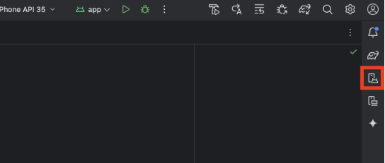
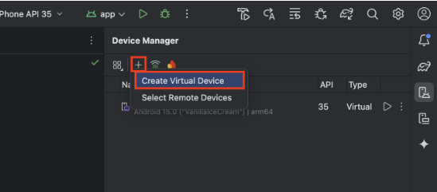
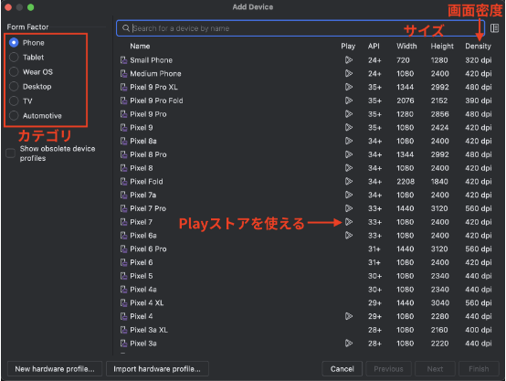
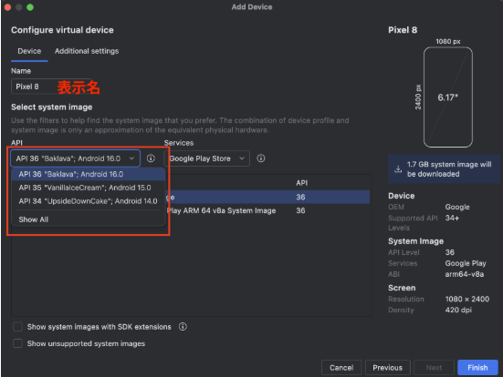
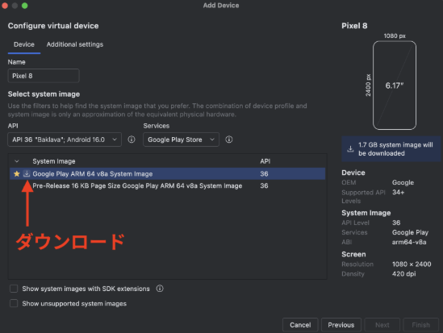
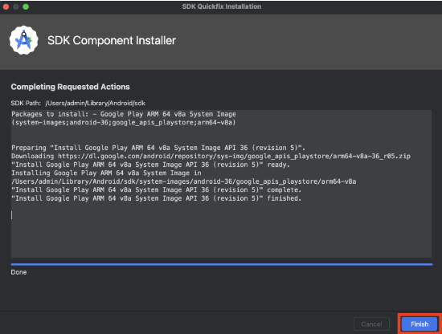
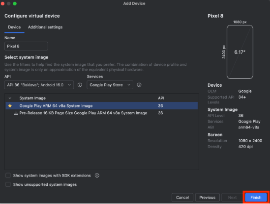
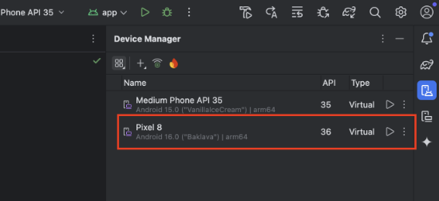

# 【Java】AndroidStudio環境構築手順書  

## はじめに  
本書では、Google公式のIDE「Android Studio」を使ってJavaによるAndroidアプリ開発のための環境を構築する手順を示す。    

## 前提条件  
- Windows 11 64ビットＰＣ　（RAM容量16GB以上推奨　∵8Gだとエミュレータ動作が重くなる）  

## 手順  
### Android Studioのインストール  
1. 以下のページにアクセスする    
https://developer.android.com/studio?hl=ja  
2. 「Android Studio Narwhal 3 Feature Drop をダウンロード」をクリックする。（この画面は環境・時期によって変わる可能性があるので注意）     
  
3. 利用規約に同意し、インストーラーをダウンロードする。  
4. ダウンロードしたインストーラーを実行。  
5. 「wWelcom to Android Studio Setup」の画面が開くので[Next]をクリックする。  
6. [Android Vitrual Device]にチェックが入っていることを確認して[Next]をクリックする。  
7. インストール場所を確認して[Next]をクリックする。  
8. スタートメニューでの表示名を確認して[Install]をクリックする。  
9. インストールが終わったら[Next]をクリックする。  
10. [Start Android Studio]にチェックが入っていることを確認して[Finish]をクリックする。  
11. [Do not import settings]を選択して[OK]をクリックする。  
12. AndroidStudioの使用状況をGoogleに送信するかどうか選択する。  
13. 「Welcome Android Studio」の画面が表示されるので[Next]をクリックする。  
14. セットアップ方法の選択画面が表示されるので[Standard]にチェックを入れ[Next]をクリックする。  
15. 「Verify Setting」の画面が表示されるので[Next]をクリックする。  
16. 「License Agreement」の画面が表示されるのですべての項目に[Accept]にチェックを入れ[Finish]をクリックする。  
17. 処理が終わったら[Finish]をクリックする。  
18. AndroidStudioのスタート画面が表示されたインストール＆初期設定完了。  

### プロジェクトの作成  
1. New Projectをクリック  
2. アプリのレイアウトを選ぶ。今回は「Empty Views Activity」を選択し[Next]をクリック  
3. プロジェクトの名前、パッケージ名、プロジェクトの保存場所、使用する言語、使用するAPI(Minimum SDK)を設定する。  
   - パッケージ名はPlayストアなどで一般公開する場合はドメインを取得して他のアプリと重複しないようにする必要がある。   
   - 使用する言語は「Java」とする。  
   - 使用するAPIは「API21」とする。  
   - 6つ目の「Build configuration language」はアプリの設定ファイルに使う言語の選択であるが、デフォルトのままでOK  
 - すべての項目を入力したら[Finish]をクリック 
4. プロジェクトが作成される。  
5. 必要に応じてプロジェクトの設定を変更する  
   - 画面右上の歯車アイコンをクリックし [Settings...]をクリック  
   - 左上の検索ボックスに「auto import」と入力し、[Editor]>[General]>[Auto Import]をクリックし、以下の場所にチェックを入れる  
      
    - [Apply]をクリックし、[OK]で完了する  
6. エミュレーターの起動  
   - 画面右端の上から3つ目あたりのボタンから「Device Manager」を開く  
      
   - 「+」ボタンを押して「Create Virtual Device」を選択する  
  　  
   - エミュレータとして使用したいデバイス(機種)を選択し、[Next]をクリック  
     
   - エミュレータの表示名とAndroidバージョンを選択する  
    
   - 使用したいAPIがダウンロードされていない場合はダウンロードアイコンをクリック  
     
   - ダウンロードが完了したら右下の[Finish]をクリック  
      
   -  APIバージョンを選択して右下の[Finish]をクリック  
   
   - Divice Managerにエミュレータが追加されたら完了  
       