# 【Java】Webサーバー環境構築手順書

## はじめに
本書では、eclipse（pleiades-2019）を使ってApach-Tomcat・Java-ServletによるWebサーバー環境を構築する手順を示す。  

## 前提条件
・Windows11 64ビットPCを用いること  
・pleiades All in one（eclipse 2019）のインストールが完了していること  
・mysql v8 をインストール済みであること([mysql環境構築手順書](../mysql環境構築手順書/mysql環境構築手順書.md)参照)  

## 手順
### Tomcatの設定
1. eclipseを起動する。
2. [ウィンドウ]>[ビューの表示]>[その他]をクリックする。  
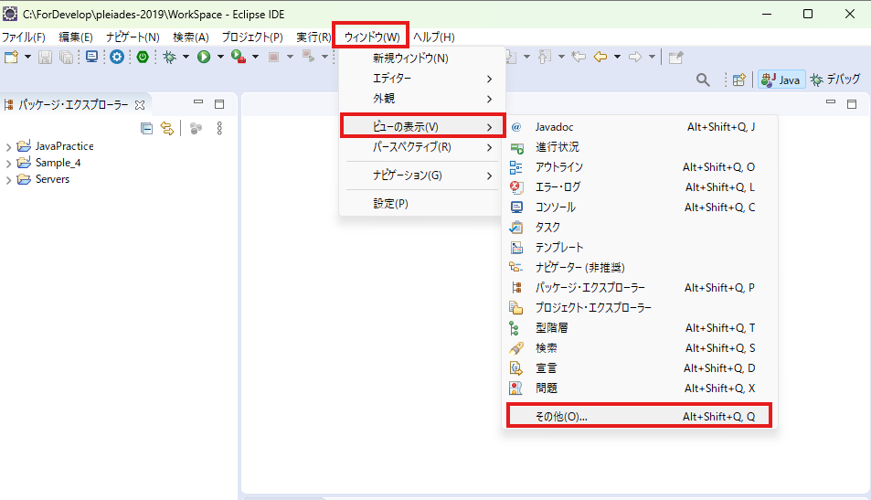  
3. [サーバー]>[サーバー]を選択し[開く]をクリックする。  
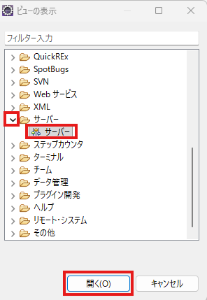  
4. サーバーウィンドウが開き、「使用可能なサーバーがありません。このリンクをクリックして新規サーバーを作成してください。」と表示されている箇所をクリックする。  
5. [Apach]>[Tomcat v9.0 サーバー]を選択し、「完了」をクリックする。  
6. プロジェクトウィンドウに「Servers」が追加される。  
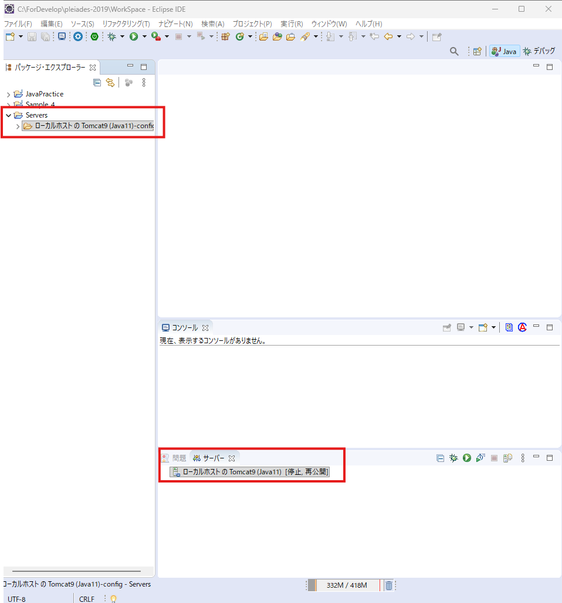
7. JDBCドライバをTomcat配下に移動する。  
    - JDBCドライバのコピー元  
   "C:\Program Files (x86)\MySQL\Connector J 8.0\mysql-connector-java-8.0.21.jar"  
    - JDBCドライバコピー先   
    "C:\ForDevelop\pleiades-2019\pleiades\tomcat\9\lib"  

### Tomcatを用いたプロジェクトの作成
1. プロジェクトウィンドウで右クリックし、[新規]>[プロジェクト...]>[Web]>[動的プロジェクト]を選択し、[次へ]をクリックする。  
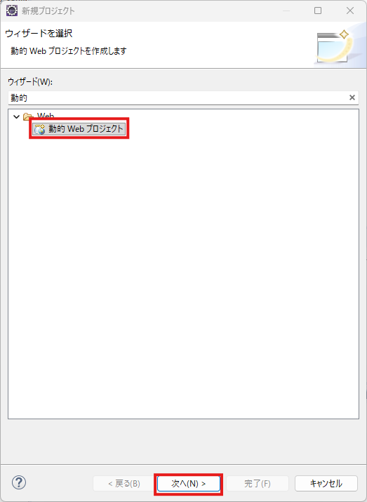  
2. プロジェクト名を入力し、[完了]をクリックする。  
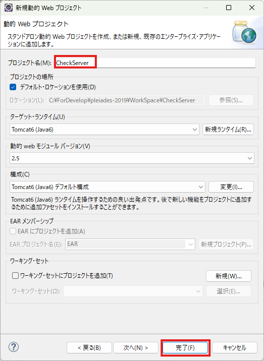  

### サーブレットの動作確認
1. 前工程で作成したプロジェクト配下のsrcフォルダの上で右クリックし[新規]>[その他]をクリックする。    
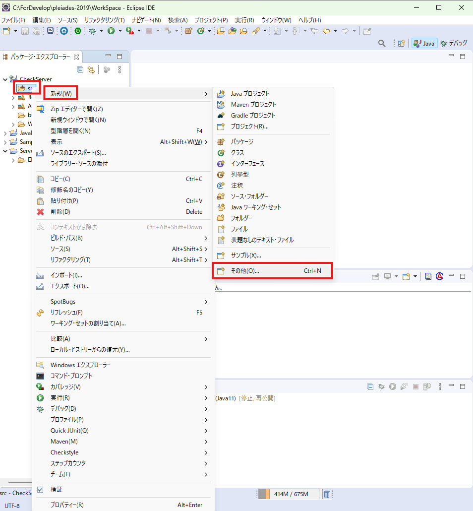
2. [web]>[サーブレット]を選択し[次へ]をクリックする。  
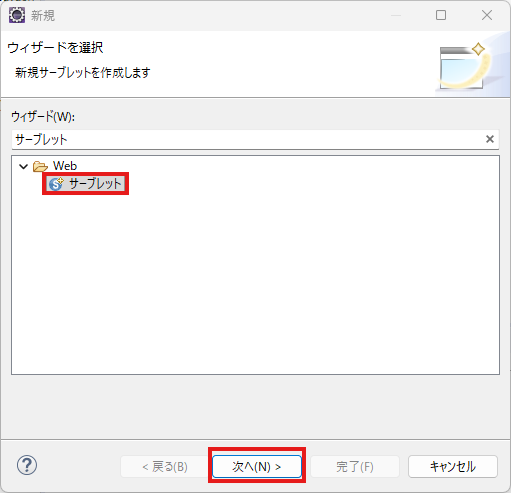  
3. クラス名を入力し、[完了]をクリックする。  
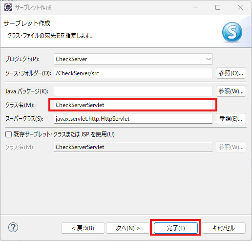
4. 3で指定したクラス名の.javaファイルが出来上がるので、doGetメソッドの中身を以下に書き換える。  
```java
	/**
	 * @see HttpServlet#doGet(HttpServletRequest request, HttpServletResponse response)
	 */
	protected void doGet(HttpServletRequest request, HttpServletResponse response) throws ServletException, IOException {
		response.setContentType("text/html;charset=Shift_Jis");
		PrintWriter out = response.getWriter();
		out.println(" <html>                                               ");
		out.println("   <head>                                             ");
		out.println("     <title>Servletの動作確認</title>                 ");
		out.println("   </head>                                            ");
		out.println("   <body>                                             ");
		out.println("     <p>Servletが動作していることを確認しました。</p> ");
		out.println("   </body>                                            ");
		out.println(" </html>                                              ");

	}
```
5. 対象のソースコードを右クリックし、[実行]>[サーバーで実行]をクリックする。  
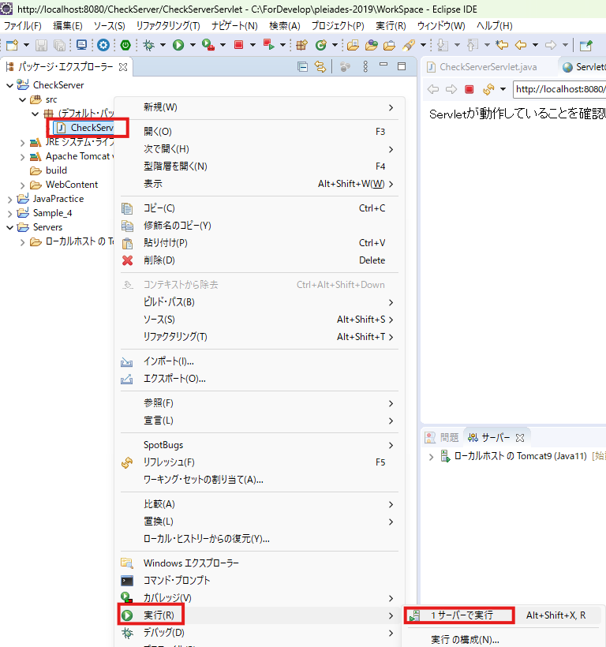  
6. [既存のサーバーを選択]をチェックし[完了]をクリックする。  
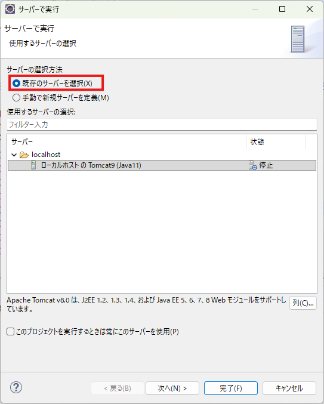  
7. 以下の画面が表示されれば、サーブレットの接続成功  
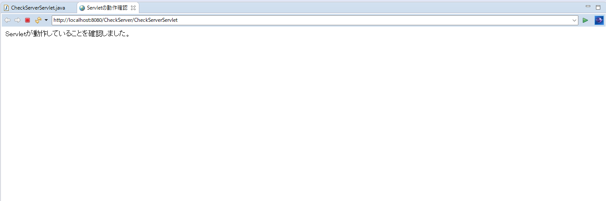  